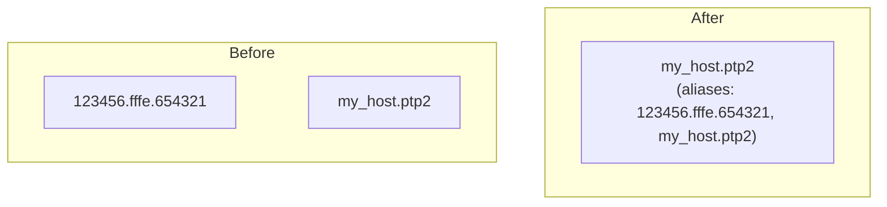
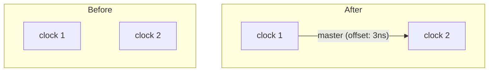
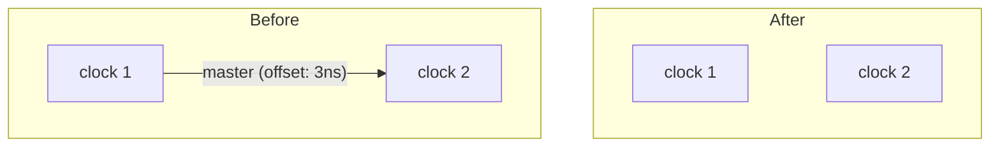
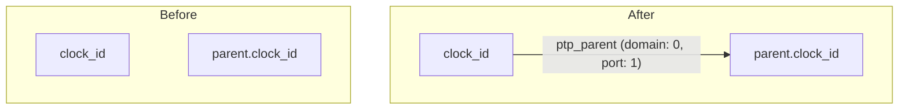
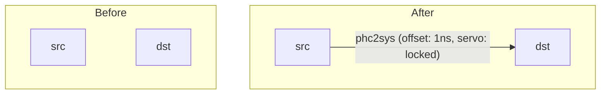
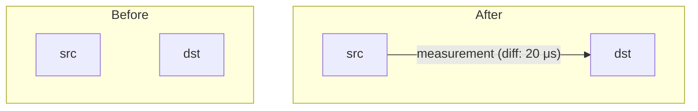
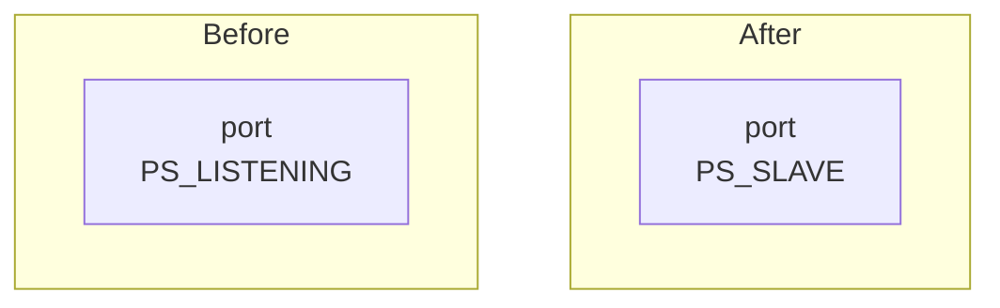
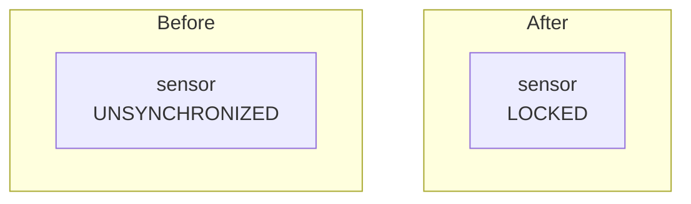

SYNC.TOOLING is designed to ensure that the given distributed system, including ECUs,
sensors and other network equipment, is synchronized correctly.

While software like [LinuxPTP](https://sourceforge.net/projects/linuxptp/) and its command line
programs `ptp4l` and `phc2sys` can ensure reliable synchronization, they do not make their
diagnostics available to other programs.
Further, equipment like sensors might not support common diagnostics protocols at all,
necessitating custom means of ensuring correct synchronization.

## Requirements

SYNC.TOOLING is required to

- {{ label("req.realtime") }} provide online real-time[^3] diagnostics
    - {{ label("req.ros") }} to ROS 2 (SYNC.DIAG) and
    - {{ label("req.web") }} via web interface (SYNC.DOCTOR)
    - {{ label("req.preexisting") }} for pre-existing setups (e.g. vehicles set up before
      SYNC.TOOLING became available)
- {{ label("req.replay") }} provide offline analysis of recorded data
- be shippable as systemd services
- be one-click installable for troubleshooting purposes
- neither raise false positives (e.g. triggering MRM on a transient fault)
- nor report actual faults too late or not at all

## General Assumptions

In designing this software suite, the following assumptions have been made:

- the time synchronization mechanism is PTPv2[^1]
- all ECUs that participate in PTP time synchronization
    - {{ label("asm.ptp4l") }} are running `ptp4l` to synchronize with other network devices
    - {{ label("asm.phc2sys") }} are running `phc2sys` to synchronize their internal clocks (if
      there are multiple)
    - {{ label("asm.systemd") }} are running `ptp4l` and `phc2sys` instances as systemd units
    - {{ label("asm.no-other") }} are not performing any other time synchronization, e.g.
      using `ptpd` or non-systemd units
- all sensors that participate in PTP provide a way to compare their clock with another one
  in the system
    - for example, sending timestamps in their packets, that can then be compared with the
      receiving ECU's clock
    - {{ label("asm.nebula") }} sensors without native PMC support are expected to be supported
      through [Nebula][7]
- not all devices that participate in time synchronization are fully observable
    - for example, some devices might not have any diagnostics interfaces
    - some devices might only report status information, but no info on their parent or master
      PTP instances
- in case of synchronization loss, clocks take multiple seconds[^2] to drift far enough apart
  to be problematic

[^1]: Specifically
  [IEEE 1588v2 (PTPv2)](https://standards.ieee.org/ieee/1588/4355/),
  [IEEE 802.1AS (gPTP)](https://standards.ieee.org/ieee/802.1AS/7121/) or
  [AutoSAR EthTSyn (gPTP Automotive Profile)][5]

[^2]: This should be in the order of tens of seconds, but we are, somewhat arbitrarily,
  defining this as `5s` here.

[5]: https://www.autosar.org/fileadmin/standards/R21-11/CP/AUTOSAR_SWS_TimeSyncOverEthernet.pdf
[7]: https://github.com/tier4/nebula

## Diagnostics Requirements

Diagnostics must be made available in real-time[^3] to ROS 2 `/diagnostics` in a manner
compatible with the [Autoware Diagnostics API][6].

The diagnostics shall be updated as often as necessary but in any case faster than the `5s`[^2]
deadline imposed above. For the time being, `1s` seems to be a good compromise[^4].

As for the actual diagnostics output, it is required that

- for every clock, the status of the synchronization to the grandmaster[^5] is diagnosed
- for missing clocks to be detected and reported
- for cycles or disconnected subgraphs to be detected and reported

[^3]: Both in the sense of the strict definition (the computations must complete by a certain
  periodic deadline), and in the sense that diagnostics are live (at most a few seconds out of
  date). See [real-time computing](https://en.wikipedia.org/wiki/Real-time_computing).

[^4]: This allows for momentary faults in communication without raising a diagnostic error.
  Further, some tools like `pmc` are too slow to operate reliably at a sub-second frequency.

[^5]: The term "grandmaster" is defined in the PTP standard, but the usage here refers to the
  clock that all other clocks synchronize to, even through means other than PTP (such as
  PHC2SYS).

[6]: https://autowarefoundation.github.io/autoware-documentation/main/design/autoware-interfaces/ad-api/features/diagnostics/

## System Architecture

Given the above requirements and assumptions, the following architecture has been designed:

![Diagnostics [Architecture]](img/sync_tooling.drawio)

The *Sync Worker* instances are using the systemd journal according to {{ ref("asm.systemd") }}
to query the status of the `ptp4l` and `phc2sys` instances according to {{ ref("asm.ptp4l") }}
and {{ ref("asm.phc2sys") }}. This indirect communication satisfies {{ ref("req.preexisting") }}.
Assumption {{ ref("asm.no-other") }} eliminates the need for additional monitoring for other
possibly interfering services.

Workers are publishing their updates via ROS 2 on a topic `/sync_diag/graph_updates`.
Sensors that participate in PTP synchronization are integrated using Nebula according to
{{ ref("asm.nebula") }}. Nebula too publishes its updates via the same topic. This communication
mechanism satisfies {{ ref("req.replay") }} by making record/replay functionality available
through `ros2 bag record` and `ros2 bag play`.

The *Sync Master* instance is subscribing to the above topic, and assembles all received
information into a graph, which is subsequently used to diagnose the synchronization status of
the system as a whole, as well as every clock within it. The Sync Master provides *SYNC.DOCTOR*,
which satisfies {{ ref("req.web") }}, and *SYNC.DIAG*, which satisfies {{ ref("req.ros") }}.

## Synchronization Graph

### Graph Structure

The synchronization graph (sync graph) is a directed graph where

- nodes represent clocks
- edges represent real or virtual links between two clocks

Each clock is a hardware clock device that can participate in PTP or PHC2SYS synchronization,
such as the clock of a sensor or a network interface, or an ECU's system clock.

A link between two clocks can be

- (real) a PTP synchronization link
- (real) a PHC2SYS synchronization link
- (virtual) a measurement performed by means different from PTP or PHC2SYS

The graph is constructed from [`GraphUpdate`][graph-update] messages, which provide pieces of
information about the graph observable by individual workers.

[graph-update]: reference/sync_tooling_msgs/graph_update_pb2.md

### Clock Naming

Clocks are identified by different names depending on the context:

- PTP uses a MAC address based clock identifier
- PTP4L and PHC2SYS use a PTP clock identifier, interface name or Linux clock device name
- Nebula uses the sensor's frame ID

Since it is not possible in general to observe all aliases of a clock from a single worker,
these identifiers are related to each other by the [`ClockAliasUpdate`][clock-alias-update]
update type.

[clock-alias-update]: reference/sync_tooling_msgs/clock_alias_update_pb2.md
[clock-master-update]: reference/sync_tooling_msgs/clock_master_update_pb2.md
[ptp-parent-update]: reference/sync_tooling_msgs/ptp_parent_update_pb2.md
[phc2sys-update]: reference/sync_tooling_msgs/phc2sys_update_pb2.md
[clock-diff-measurement]: reference/sync_tooling_msgs/clock_diff_measurement_pb2.md
[port-state-update]: reference/sync_tooling_msgs/port_state_update_pb2.md
[self-reported-clock-state-update]: reference/sync_tooling_msgs/self_reported_clock_state_update_pb2.md
[ptp4l-status-message]: reference/sync_tooling_msgs/ptp4l_status_message_pb2.md
[ptp4l-port-status-message]: reference/sync_tooling_msgs/ptp4l_port_status_message_pb2.md
[phc2sys-status-message]: reference/sync_tooling_msgs/phc2sys_status_message_pb2.md

In the user-facing SYNC.DOCTOR and SYNC.DIAG, the most human-readable representation of each
clock is shown in case of multiple aliases. See [get_most_human_readable_alias][readable-alias]
for the specific ordering.

[readable-alias]: reference/sync_graph/sync_graph.md#sync_graph.sync_graph.get_most_human_readable_alias

### Statelessness

SYNC.TOOLING is designed to be stateless. The main motivation behind this is to avoid having to
read potentially tens of thousands of lines of the systemd journal in order to begin operations.
Instead, the sync graph operates only on information received in the last `timeout` seconds,
and the workers retransmit information at least once per second.

### Graph Update Types

The synchronization graph is constructed from various types of updates, each representing a
mostly atomic piece of the system. These updates are sent by workers and other components to the
diagnostic master, which assembles them into a coherent graph structure.

#### [`ClockAliasUpdate`][clock-alias-update]

Clock alias updates establish relationships between different identifiers that refer to the same
physical clock. This is necessary because different components may refer to the same clock using
different naming schemes:

- **PTP Clock IDs**: MAC address-based identifiers used by PTP protocol, e.g. `123456.fffe.654321`
- **System Clock IDs**: Human-readable names like `my_host.sys`
- **Interface IDs**: Network interface identifiers, e.g. `my_host.eno1`
- **Linux Clock Device IDs**: Device names like `my_host.ptp0` (`/dev/ptp0`)
- **Sensor IDs**: Frame IDs used by sensors, e.g. `sensor@lidar/***REMOVED***`

When an alias update is received, the graph combines all nodes representing the same clock and
updates all references to use the most human-readable identifier.

**Example:**

```python
--8<-- "sync_tooling_msgs/examples/clock_alias_update_examples.py:basic_alias"
```



#### [`ClockMasterUpdate`][clock-master-update]

Clock master updates represent PTP master-slave relationships and their reported time offset.
These updates include:

- **clock_id**: The slave clock that is being synchronized
- **master**: The master clock (optional - if not set, indicates that no master is present)
- **master_offset_ns**: The offset from master as reported by PTP (ignored if no master is
  present)

**Role in Graph**: Creates directed edges labeled as "master" links, representing the
synchronization hierarchy.

**Example:**

```python
--8<-- "sync_tooling_msgs/examples/clock_master_update_examples.py:master_slave_relationship"
```



```python
--8<-- "sync_tooling_msgs/examples/clock_master_update_examples.py:no_master"
```



#### [`PtpParentUpdate`][ptp-parent-update]

PTP parent updates establish parent-child relationships in the PTP synchronization tree. These
represent the PTP port hierarchy:

- **clock_id**: The child clock
- **parent**: The parent PTP port (includes clock ID, port number, and PTP domain)

**Role in Graph**: Creates directed edges labeled as "ptp_parent" links, representing the PTP
port hierarchy. Port number 0 (reserved for internal PTP mechanisms such as local PMC queries
and PHC2SYS synchronization) is discarded.

**Example:**

```python
--8<-- "sync_tooling_msgs/examples/ptp_parent_update_examples.py:ptp_parent_child"
```



#### [`Phc2SysUpdate`][phc2sys-update]

PHC2SYS updates represent synchronization relationships between hardware clocks and system
clocks via PHC2SYS:

- **src**: The source hardware clock (e.g., network interface PTP clock)
- **dst**: The destination system clock
- **clock_state**: The slave clock state including offset measurements and servo state

**Role in Graph**: Creates directed edges labeled as "phc2sys" links, representing
hardware-to-system clock synchronization.

**Example:**

```python
--8<-- "sync_tooling_msgs/examples/phc2sys_update_examples.py:phc2sys_sync"
```



#### [`ClockDiffMeasurement`][clock-diff-measurement]

Clock difference measurements represent time offset measurements between clocks that are not
performed by PTP or PHC2SYS directly. These are typically used for:

- Sensor timestamp comparisons with packet ingress times
- Sanity checks like reading and comparing clock timestamps manually

**Fields:**

- **src**: The source clock for the measurement
- **dst**: The destination clock for the measurement  
- **diff_ns**: The time difference (`time(dst) - time(src)`). Can be negative.

**Role in Graph**: Creates directed edges labeled as "measurement" links, representing virtual
synchronization relationships based on external measurements.

**Example:**

```python
--8<-- "sync_tooling_msgs/examples/clock_diff_measurement_examples.py:clock_diff_measurement"
```



#### [`PortStateUpdate`][port-state-update]

Port state updates report the operational state of PTP ports:

- **port_id**: The PTP port identifier
- **port_state**: The current state of the port (e.g., LISTENING, MASTER, SLAVE, etc.)

**Role in Graph**: Stores port state information for diagnostic purposes. Port number 0
(internal PTP mechanisms) is discarded.

**Example:**

```python
--8<-- "sync_tooling_msgs/examples/port_state_update_examples.py:port_state_update"
```



#### [`SelfReportedClockStateUpdate`][self-reported-clock-state-update]

Self-reported clock state updates contain status information directly reported by clocks
(typically sensors):

**States:**

- **UNSYNCHRONIZED**: Clock is not synchronized
- **TRACKING**: Clock is attempting to synchronize but not yet within tolerance
- **LOCKED**: Clock is synchronized within tolerance
- **LOST**: Clock was previously synchronized but has lost synchronization

**Role in Graph**: Stores self-reported synchronization status for diagnostic evaluation.

**Example:**

```python
--8<-- "sync_tooling_msgs/examples/self_reported_clock_state_update_examples.py:self_reported_clock_state"
```



#### Status Messages

The following update types provide status and error information from PTP and PHC2SYS components:

**[`Ptp4lStatusMessage`][ptp4l-status-message]**

- Reports warnings and errors from PTP4L instances
- Includes the affected clock ID and severity level

**[`Ptp4lPortStatusMessage`][ptp4l-port-status-message]**

- Reports warnings and errors specific to PTP ports
- Includes the affected port ID and severity level

**[`Phc2SysStatusMessage`][phc2sys-status-message]**

- Reports warnings and errors from PHC2SYS instances
- Includes source clock, affected destination clocks, and severity level

**Role in Graph**: These messages are currently stored but not actively used for graph
construction. They provide additional diagnostic context for troubleshooting synchronization
issues.

#### Update Processing

When updates are received, the graph ensures consistency by:

1. **Clock Creation**: New clocks referenced in updates are automatically added to the graph
2. **Alias Resolution**: All clock references are updated to use canonical (most human-readable)
   identifiers
3. **Edge Management**: Multiple edge types can exist between the same pair of clocks (master,
   ptp_parent, phc2sys, measurement)
4. **Self-Loop Prevention**: Updates that would create self-loops (a clock synchronizing to
   itself) are ignored
5. **Port Tracking**: Port information is maintained separately from the main graph structure

The graph maintains both the main synchronization structure and metadata about ports and clock
states, enabling comprehensive diagnostic analysis of the entire time synchronization system.

## Tech Stack

The following technologies are used:

| Technology          | Usage                         | Rationale                                                                    |
| ------------------- | ----------------------------- | ---------------------------------------------------------------------------- |
| Python 3.10         | All program logic             | Type system, ease of interfacing with, development speed                     |
| [Protobuf][1]       | Internal interfaces           | Support for sum types (oneof), self-referential data structures (e.g. trees) |
| ROS 2               | Transport layer               | Familiarity, no additional network setup necessary                           |
| ROS 2               | Diagnostics (SYNC.DIAG)       | Interoperability with Autoware                                               |
| [Flask][2]          | Web server (SYNC.DOCTOR)      | Fast and simple, other frameworks such as FastAPI would be fine too          |
| [Apache ECharts][3] | Graph rendering (SYNC.DOCTOR) | Design, smoothness, ease of integration                                      |
| [NetworkX][4]       | Graph analysis                | De-facto standard graph analysis library for Python                          |

[1]: https://protobuf.dev/
[2]: https://flask.palletsprojects.com/en/stable/
[3]: https://echarts.apache.org/en/index.html
[4]: https://networkx.org/documentation/stable/index.html
