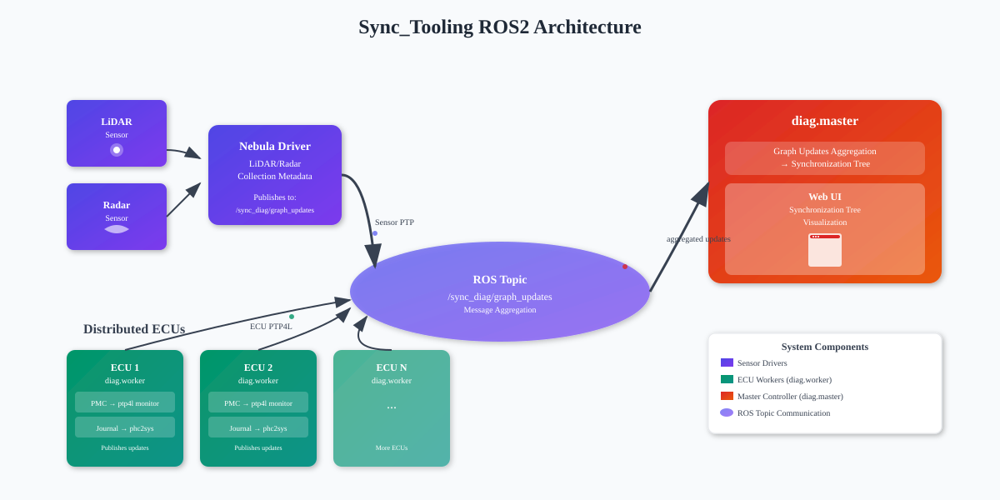

This manual is for teams that want to integrate SYNC.DIAG into their vehicle architecture.

It is assumed that the vehicle is using [Pilot Auto][pilot-auto], is set up using Ansible,
and has access to [Autoware ECU System Setup][autoware-ecu-system-setup] Ansible roles.

[pilot-auto]: https://github.com/tier4/pilot-auto
[autoware-ecu-system-setup]: https://github.com/tier4/autoware_ecu_system_setup

## Overall ROS2 Architecture

## Pre-Requisites

### Setup ECU IP Configuration and PTP

The ECU, sensor and network architecture has been decided and set up. This includes things like
Netplan configuration and IP address assignments.

The network architecture has to be compatible with the specific ECUs' and sensors' supported
PTP profiles.

The [PTP Architecture Guide](ptp-architecture-guide.md) has been followed to set up the
PTP architecture, including all PTP4L and PHC2SYS configuration.

### Setup Diagnostics in Sensor Driver

Setup `nebula>=v0.2.8` and sensor configuration to output synchronization meta data on `/sync_diag/graph_updates`.

Please check the configuration example in [this PR](https://github.com/tier4/aip_launcher/pull/529)

## SYNC.DIAG

Once a PTP architecture is set up, SYNC.DIAG can be configured to monitor synchronization
status and publish it to ROS 2.

### Setup

Install and configure SYNC.DIAG via the [autoware_ecu_system_setup.sync_tooling][role-sync-tooling]
role on every ECU that participates in PTP synchronization.

The SYNC.DIAG Master is only required once, and should be run on an ECU that publishes or
processes ROS 2 `/diagnostics`. Usually, the main Autoware ECU is a good choice.

SYNC.DIAG Workers are required on every ECU that participates in PTP synchronization, including
the one running the SYNC.DIAG Master. Each worker has to be configured with a list of
`ptp4l` and `phc2sys` instances to monitor.

!!! bug
    Again, make sure that, if there are multiple `ptp4l` instances, they have different
    UDS addresses set via `--uds_address`. Otherwise, SYNC.TOOLING will not be able to
    communicate with them.

All ECUs running a SYNC.DIAG Worker and/or Master must be able to communicate over ROS 2, as
the `/sync_diag/graph_updates` topic is used to send status updates to the master.

More information on requirements can be found in the [Manual Installation Guide](installation.md).

More information on the required configuration file can be found in the [Usage Guide](usage.md).

[role-sync-tooling]: https://github.com/tier4/autoware_ecu_system_setup/tree/590fabea4f21811a0a69e26793e4fff4f9b60bd1/roles/sync_tooling

### Running SYNC.DIAG

SYNC.DIAG is started automatically as a systemd service on every ECU that has been configured.
To make sure it is working correctly, check the output in ROS 2 `/diagnostics`. Also check
that none of the services crash or fail to start.

### Running SYNC.DOCTOR

To access the web interface SYNC.DOCTOR, the SYNC.DIAG Master has to be launched with the
`--web-ui` option. This will start a web server on port `5000` of the ECU running the master.
