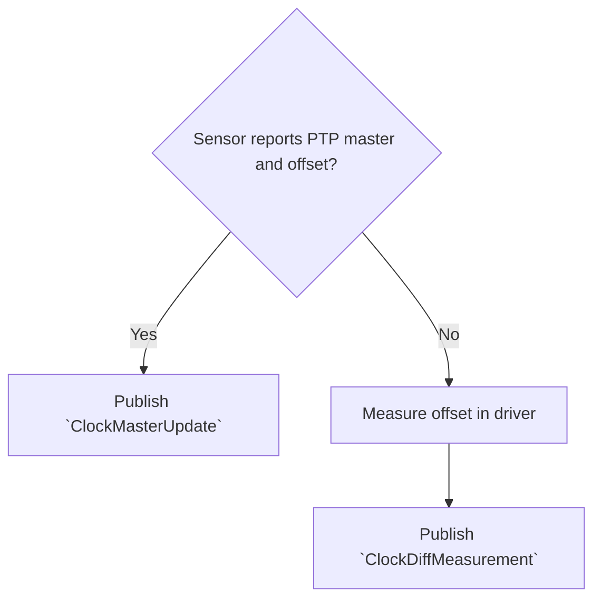

# Sensor Driver Integration

This guide explains how to integrate external sensor drivers with SYNC.TOOLING.
By following this guide, sensors that do not support PTP Management messages can be
integrated with SYNC.TOOLING, allowing for comprehensive synchronization diagnostics.

## Overview

Sensors rarely support the PTP Management messages SYNC.TOOLING relies on to observe PTP status.
Further, not all sensors synchronize time via PTP in the first place.
For a sensor to participate in SYNC.TOOLING diagnostics, its driver has to implement the
following:

1. **Identification**: Use a unique `SensorId` (typically the ROS 2 frame ID).
2. **State Reporting**: Periodically publish its synchronization lock status.
3. **Measurement Reporting**: Report time offsets between the sensor and the host system clock.
4. **PTP-specific Reporting**: Report sensor's PTP Clock ID and parent port information.

!!! tip
    If the sensor fully supports PTP Management messages, driver support is not required.
    Check this by [setting up](usage.md#configuration) the ECU the sensor is connected to in
    SYNC.TOOLING, and confirming
    that the sensor shows up in SYNC.DOCTOR.

## Message Transport

SYNC.TOOLING uses [Protobuf](https://protobuf.dev/) as its interface definition language.
This is motivated by the lack of support for sum types ([oneof][oneof-ref]) and tree-like data
structures in ROS 2 message definitions.

The transport layer however, is still ROS 2 pub/sub as ROS 2 is already configured on all ECUs
running Autoware.

This yields the following communication stack:

* **Topic**: `/sync_diag/graph_updates`
* **Message Type**: `std_msgs/msg/UInt8MultiArray`
* **Payload**: A serialized [`GraphUpdate`][graph-update] Protobuf message.

Drivers should serialize each Protobuf message to a byte array and publish it as the `data`
field of a `UInt8MultiArray`:

=== "C++"

    ```cpp
    #include <sync_tooling_msgs/graph_update.pb.h>
    #include <std_msgs/msg/u_int8_multi_array.hpp>

    void publish_graph_update(const GraphUpdate& gu) {
        auto ros2_msg = std_msgs::msg::UInt8MultiArray();
        ros2_msg.data.resize(gu.ByteSizeLong());
        gu.SerializeToArray(ros2_msg.data.data(), ros2_msg.data.size());
        publisher->publish(ros2_msg);
    }
    ```

=== "Python"

    ```python
    from sync_tooling_msgs.graph_update_pb2 import GraphUpdate
    from std_msgs.msg import UInt8MultiArray

    def publish_graph_update(gu: GraphUpdate):
        ros2_msg = UInt8MultiArray()
        ros2_msg.data = gu.SerializeToString()
        publisher.publish(ros2_msg)
    ```

## Protocol

The `diag-master` constructs the synchronization graph from [`GraphUpdate`][graph-update]
messages. A `GraphUpdate` is a wrapper containing exactly one of several update message types.

### Primary Updates for Sensors

#### [`ClockAliasUpdate`][clock-alias-update]

Relates the sensor's `SensorId` to other known aliases of the sensor, e.g. its `PtpClockId`.
All aliases known by the driver should be reported in a single `ClockAliasUpdate` message:

=== "C++"

    ```cpp
    #include <sync_tooling_msgs/graph_update.pb.h>

    using namespace sync_tooling_msgs;

    GraphUpdate make_clock_alias_update(
        const std::string& frame_id, 
        const std::string& ptp_clock_id) 
    {
      GraphUpdate gu;
      auto* u = gu.mutable_clock_alias_update();
      u->add_aliases()->mutable_sensor_id()->set_frame_id(frame_id);
      u->add_aliases()->mutable_ptp_clock_id()->set_id(ptp_clock_id);

      return gu;
    }
    ```

=== "Python"

    ```python
    from sync_tooling_msgs.graph_update_pb2 import GraphUpdate

    def make_clock_alias_update(frame_id: str, ptp_clock_id: str):
        gu = GraphUpdate()
        u = gu.clock_alias_update
        u.aliases.add().sensor_id.frame_id = frame_id
        u.aliases.add().ptp_clock_id.id = ptp_clock_id
        
        return gu
    ```

#### [`SelfReportedClockStateUpdate`][self-reported-clock-state-update]

Reports the sensor's internal synchronization status (e.g., `LOCKED`, `TRACKING`,
`UNSYNCHRONIZED`).

=== "C++"

    ```cpp
    #include <sync_tooling_msgs/graph_update.pb.h>

    using namespace sync_tooling_msgs;

    GraphUpdate make_self_reported_clock_state_update(
        const std::string& frame_id, 
        bool is_locked) 
    {
      GraphUpdate gu;
      auto* u = gu.mutable_self_reported_clock_state_update();
      u->mutable_clock_id()->mutable_sensor_id()->set_frame_id(frame_id);
      u->set_state(is_locked ? SelfReportedClockStateUpdate::LOCKED 
                             : SelfReportedClockStateUpdate::UNSYNCHRONIZED);

      return gu;
    }
    ```

=== "Python"

    ```python
    from sync_tooling_msgs.graph_update_pb2 import GraphUpdate
    from sync_tooling_msgs.self_reported_clock_state_update_pb2 import SelfReportedClockStateUpdate

    def make_self_reported_clock_state_update(frame_id: str, is_locked: bool):
        gu = GraphUpdate()
        u = gu.self_reported_clock_state_update
        u.clock_id.sensor_id.frame_id = frame_id
        u.state = (SelfReportedClockStateUpdate.LOCKED if is_locked else 
                  SelfReportedClockStateUpdate.UNSYNCHRONIZED)
        
        return gu
    ```

#### Time Offset Measurements

Clocks that support PTP Management messages can report the offset as measured by PTP itself.
Sensors that do not support PTP Management messages have to rely on

* measurements in the driver
* measurements reported by the sensor

The following diagram illustrates the decision flow:



##### [`ClockMasterUpdate`][clock-master-update]

If the sensor reports its PTP master, and its master offset, the driver should publish a
`ClockMasterUpdate` message.

##### [`ClockDiffMeasurement`][clock-diff-measurement]

Reports a measured offset between two clocks. For sensors, this is typically the difference
between the sensor's internal timestamp included in the packets it sends, and the system
clock's ingress timestamp (e.g., via `SO_TIMESTAMPING`).

!!! warning
    `SO_TIMESTAMPING` uses the **system clock**, even if the network interface supports
    hardware time stamping. Be sure to set the `src` field to the system clock in the
    `ClockDiffMeasurement` message.

=== "C++"

    ```cpp
    #include <sync_tooling_msgs/graph_update.pb.h>
    #include <unistd.h>

    using namespace sync_tooling_msgs;

    GraphUpdate make_clock_diff_measurement_update(
        const std::string& frame_id, 
        int64_t offset_ns) 
    {
      char hostname[HOST_NAME_MAX + 1];
      gethostname(hostname, sizeof(hostname));

      GraphUpdate gu;
      auto* m = gu.mutable_clock_diff_measurement();
      m->set_diff_ns(offset_ns);
      m->mutable_src()->mutable_system_clock_id()->set_hostname(hostname);
      m->mutable_dst()->mutable_sensor_id()->set_frame_id(frame_id);

      return gu;
    }
    ```

=== "Python"

    ```python
    import socket
    from sync_tooling_msgs.graph_update_pb2 import GraphUpdate

    def make_clock_diff_measurement_update(frame_id: str, offset_ns: int):
        gu = GraphUpdate()
        m = gu.clock_diff_measurement
        m.diff_ns = offset_ns
        m.src.system_clock_id.hostname = socket.gethostname()
        m.dst.sensor_id.frame_id = frame_id
        
        return gu
    ```

### PTP-specific Updates

If the sensor supports PTP, it should also publish:

* **[`ClockMasterUpdate`][clock-master-update]**: Reports the current PTP master of the sensor.
* **[`PtpParentUpdate`][ptp-parent-update]**: Reports the parent PTP port identity.
* **[`PortStateUpdate`][port-state-update]**: Reports the state of the sensor's PTP port
  (e.g., `SLAVE`, `FAULTY`).

## Implementation Guidelines

The following guidelines are recommended when implementing SYNC.TOOLING support in a driver.

!!! tip
    A reference implementation can be found in the [Nebula](https://github.com/tier4/nebula)
    driver (see [PR #289](https://github.com/tier4/nebula/pull/289)).

### Configuration

Drivers should expose a parameter to enable SYNC.TOOLING integration and specify the output topic.

* `sync_diagnostics.topic`: The topic to publish updates to. If empty, integration is disabled.
* `frame_id`: Used as the `SensorId`.

### Rate Limiting

To avoid overwhelming the diagnostic system with high-frequency updates (e.g., per-packet
measurements), it is highly recommended to use a rate limiter.

!!! tip
    A typical frequency is 1Hz to 10Hz (100ms - 1000ms interval).

### Measurement Noise

Even the relatively accurate `SO_TIMESTAMPING` cannot match the precision of PTP delay
measurements. This is because PTP measures and compensates for network link latency, while
manual measurements are not.

Further, manual measurements depend on timing of sensor packets, which can differ with sensor
settings and frequency of packet transmission.

Therefore, `diag-master` applies a median filter to `ClockDiffMeasurement` messages to reduce
noise. Users may further tune behavior by adjusting `diagnostics.diff_thresholds.measurement`
in the `diag-master` configuration file.

!!! warning
    Be aware of your system's timing requirements. If e.g. a sensor fusion algorithm requires
    sensors to be within `10ms` of each other, the threshold per sensor should be set to half
    of that, i.e. `5ms`, to guarantee that SYNC.TOOLING triggers an error before sensor fusion
    fails.

[graph-update]: https://tier4.github.io/sync_tooling_msgs/reference/sync_tooling_msgs/graph_update_pb2.md
[self-reported-clock-state-update]: https://tier4.github.io/sync_tooling_msgs/reference/sync_tooling_msgs/self_reported_clock_state_update_pb2.md
[clock-diff-measurement]: https://tier4.github.io/sync_tooling_msgs/reference/sync_tooling_msgs/clock_diff_measurement_pb2.md
[clock-alias-update]: https://tier4.github.io/sync_tooling_msgs/reference/sync_tooling_msgs/clock_alias_update_pb2.md
[clock-master-update]: https://tier4.github.io/sync_tooling_msgs/reference/sync_tooling_msgs/clock_master_update_pb2.md
[ptp-parent-update]: https://tier4.github.io/sync_tooling_msgs/reference/sync_tooling_msgs/ptp_parent_update_pb2.md
[port-state-update]: https://tier4.github.io/sync_tooling_msgs/reference/sync_tooling_msgs/port_state_update_pb2.md

[oneof-ref]: https://protobuf.dev/programming-guides/proto3/#oneof
